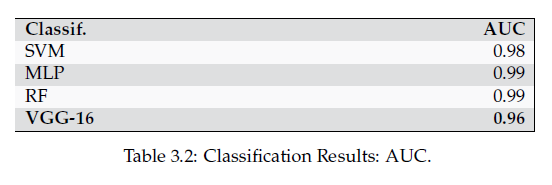

# Breast-Cancer-Classification-with-VGG-16-SVM

This was the Project Implementation of my _**MSc. Biomedical Informatics**_ [Graduation Thesis](https://www.researchgate.net/publication/361441022_Medical_Images_Classification_Based_on_Deep_Features_Extraction_Exploiting_Transfer_Learning) from [University of Tlemcen](https://ft.univ-tlemcen.dz) (Algeria :algeria:)

This is a **_Breast Cancer Classification_** Model based on fine-tuned **_VGG-16_** and _**SVM**_ to classify the [**_INbreast_** Dataset](https://drive.google.com/file/d/19n-p9p9C0eCQA1ybm6wkMo-bbeccT_62/view?usp=sharing)

I have used a whole image model by [@lishen](https://github.com/lishen), trained it on [_Google Colab_](https://colab.research.google.com) and added an [SVM.svc](https://scikit-learn.org/stable/modules/generated/sklearn.svm.SVC.html) classifier on top

Mr. Li Shen's model had performed great with **AUC=0.95** (check his [Repo](https://github.com/lishen/end2end-all-conv) and his [Paper](https://arxiv.org/abs/1708.09427) :fire:);

I managed to get **AUC=0.98** with SVM and even better with MLP and Random Forests:

:rotating_light: For any bugs or questions, feel free to report an issue over [HERE](https://github.com/iamaminebriki/Breast-Cancer-Classification-with-VGG16-and-SVM/issues) :triangular_flag_on_post:
